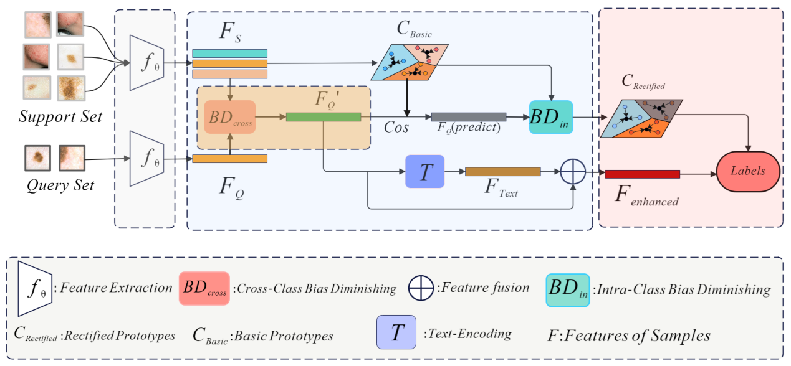
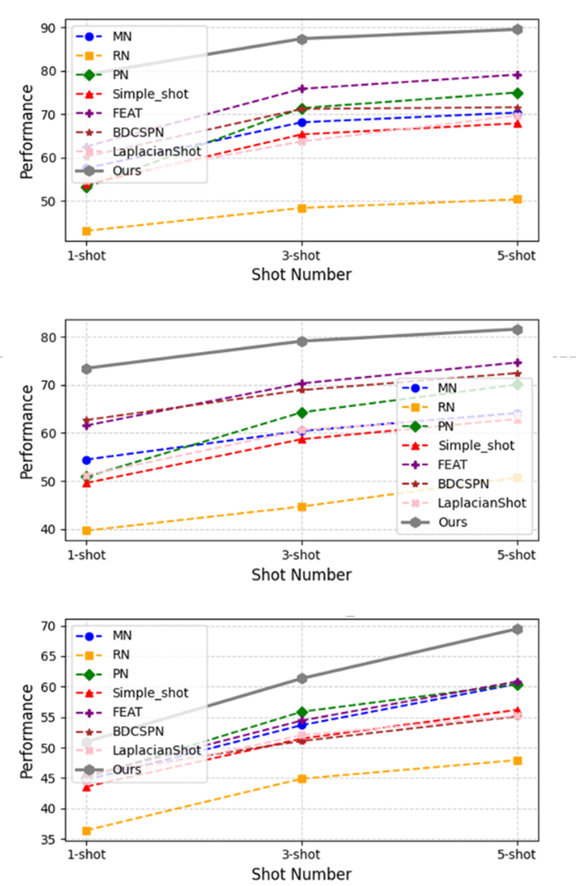
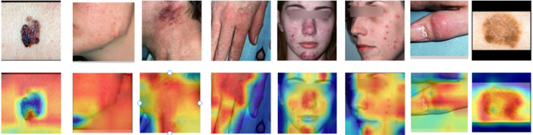

## Hybrid Vision-Language Few-Shot Learning for Dermatology: A Swin Transformer and BERT-based Approach with Prototype Rectification

### Overview

This repository contains the implementation of **ProtoSwin-BERT**, a novel few-shot learning framework tailored for fine-grained skin disease classification. Our model integrates Swin Transformer for visual feature extraction, BERT for semantic enhancement, and a prototype rectification strategy to improve classification accuracy. This approach addresses challenges such as data scarcity, intra-class diversity, and inter-class similarity in dermatological image classification.


### Key Features

- **Swin Transformer**: Extracts local and global features from skin disease images.
- **BERT**: Enhances query image features with semantic context.
- **Prototype Rectification**: Adjusts class prototypes based on support and query feature discrepancies for higher classification accuracy.


### Model Architecture

The model architecture consists of three key components:

1. **Feature Extractor**: Swin Transformer is used to capture detailed dermatological features.
2. **Feature Enhancement**: Query features are semantically enhanced using BERT to improve classification of complex fine-grained skin conditions.
3. **Prototype Rectification**: Refines the class prototypes dynamically by shifting them using feature discrepancies between the support and query sets.




### Datasets

The image sizes of all datasets were unified at 224px by 224px, and various data enhancement operations were performed, such as random cropping, rotation, color dither, and horizontal flipping. These enhancements aim to improve the generalization ability of the model and further optimize the experimental results, The model has been evaluated on the following datasets:

| Dataset  | Classes | Images | Train/Val/Test |
| -------- | ------- | ------ | -------------- |
| Derm7pt  | 34      | 2259   | 17/9/8         |
| Sd-198   | 198     | 9007   | 80/59/59       |
| Skin_cps | 30      | 2240   | 15/7/8         |

- **SD-198**: A dataset with 198 fine-grained skin disease categories and 9007 images.
- **Derm7pt**: A dataset containing over 2000 clinical images with corresponding diagnostic annotations.
- **Skin_cps**: A combination of clinical and dermoscopy images, with a total of 2240 images across 30 categories.

The data set has been made public after its own processing at the following link:

**[Mydataset](https://drive.google.com/drive/folders/1jg4itKPlFOeIVOsV7yr95ll3Fh82EWuy)**


### Dataset Structure

The datasets used in this project include Derm7pt, SD-198, and skinl_cps, all pre-processed and stored under the `data` folder. Below is a typical dataset structure:

```
data/
├── datasets/
│   ├── derm7pt/				# Datasets of derm7pt after processing
│   │       ├── images/	 		
│   │              ├── ...
│   ├─ sd-198					# Datasets of sd-198 after processing
│   │       ├── images/
│   │              ├── ...
│   ├── skinl_cps/				# Datasets of skinl_cps after processing
│   │       └─ ...
│   │
│   ├── test.json	
│   ├── train.json
│   └── val.json
│   
│   
│ 
├── derm7pt.json    # Training/validation/test set partitioning strategy for my_derm7pt datasets.
│ 
├── sd198.json      # Training/validation/test set partitioning strategy for my_sd198 datasets.
│ 
└── skinl_cps.json  # Training/validation/test set partitioning strategy for skinl_cps datasets.  
```


### Experimental Results

We conducted extensive experiments across multiple datasets using 1-shot, 3-shot, and 5-shot tasks. Our method outperforms state-of-the-art few-shot learning techniques in dermatological image classification.

| **Method**         | **sd198**  |            |            | **derm7pt** |            |            | **skinl_cps** |            |            |
| ------------------ | ---------- | ---------- | ---------- | :---------: | ---------- | ---------- | ------------- | ---------- | ---------- |
|                    | **1-shot** | **3-shot** | **5-shot** | **1-shot**  | **3-shot** | **5-shot** | **1-shot**    | **3-shot** | **5-shot** |
| **Inductive**      |            |            |            |             |            |            |               |            |            |
| MN                 | 57.52      | 68.09      | 70.32      |    54.47    | 60.41      | 64.15      | 44.72         | 53.69      | 60.45      |
| RN                 | 43.06      | 48.34      | 50.33      |    39.69    | 44.69      | 50.74      | 36.43         | 44.90      | 47.95      |
| PN                 | 53.15      | 71.37      | 74.95      |    50.88    | 64.29      | 70.07      | 45.10         | 55.89      | 60.40      |
| Simple_shot        | 53.77      | 65.30      | 67.85      |    49.61    | 58.70      | 62.90      | 43.60         | 51.48      | 56.19      |
| FEAT               | 62.52      | 75.81      | 79.07      |    61.56    | 70.31      | 74.63      | 45.36         | 54.44      | 60.85      |
| **Transductive**   |            |            |            |             |            |            |               |            |            |
| BDCSPN[11]         | 60.19      | 71.17      | 71.56      |    62.69    | 68.91      | 72.44      | 45.66         | 51.09      | 55.11      |
| LaplacianShot      | 54.74      | 63.67      | 69.66      |    51.21    | 60.61      | 63.65      | 44.48         | 52.04      | 55.21      |
| **ProtoSwin-BERT** | **79.11**  | **87.37**  | **89.51**  |  **73.46**  | **79.09**  | **81.59**  | **50.97**     | **61.35**  | **69.48**  |

More detailed results can be found in our paper.


### Results Visualization

Our model's attention mechanism can be visualized using Grad-CAM: 





## File Descriptor

FSL中的数据加载与标准分类略有不同，因为我们以少量分类任务的形式采样批量实例。
- [TaskSampler](easyfsl/samplers/task_sampler.py): 标准PyTorch Sampler对象的扩展，以少量分类任务的形式对批次进行采样
- [FewShotDataset](easyfsl/datasets/few_shot_dataset.py): 一个抽象类，用于标准化您想要使用的任何数据集的接口
- [EasySet](easyfsl/datasets/easy_set.py): 一个随时可用的FewShotDataset对象，用于处理具有类分类的目录分割的图像数据集
- [WrapFewShotDataset](easyfsl/datasets/wrap_few_shot_dataset.py): 将任何数据集转换为一个FewShotDataset对象的包装器
- [FeaturesDataset](easyfsl/datasets/features_dataset.py): 处理预提取特征的数据集
- [SupportSetFolder](easyfsl/datasets/support_set_folder.py): 用于处理存储在目录中的支持集的数据集


## QuickStart

### 1.  Installation

To run this project, follow these steps:

```bash
git clone https://github.com/...
pip install -r dev_requirements.txt
pip install easyfsl		# Install the package
```

### 2. [Download your data](https://drive.google.com/drive/folders/1jg4itKPlFOeIVOsV7yr95ll3Fh82EWuy)


## Methods

The methods used in this repository are described in detail in our accompanying paper. Below is a summary of key techniques implemented:

1. **Prototype Rectification:**
  A method to refine prototypes by aligning query features more closely with the support set distribution.
2. **Swin-Transformer Backbone:**
  A powerful transformer-based backbone for extracting robust image features.
3. **Textual Guidance via BERT:**
  To further refine feature embeddings, we introduce text-based guidance using BERT, particularly in few-shot classification scenarios.
4. **Episodic Training:**
  We follow an episodic training approach where tasks are sampled and trained iteratively, simulating the few-shot learning conditions.


## Dependencies

To install the required dependencies, run:

```bash
pip install -r dev_requirements.txt
```

The main libraries used in this project include:

- PyTorch
- Huggingface Transformers (BERT)
- Timm (Swin-Transformer)
- EasyFSL


## Acknowledgement

[easyfsl](https://github.com/sicara/easy-few-shot-learning)
[grad-cam](https://github.com/WZMIAOMIAO/deep-learning-for-image-processing/tree/master/pytorch_classification/grad_cam)

